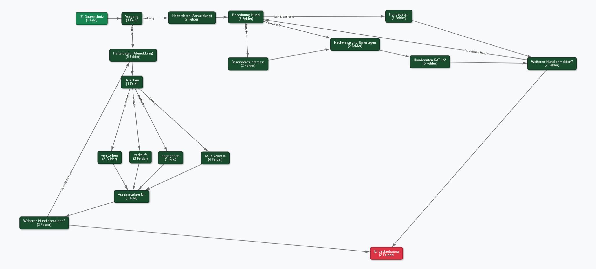
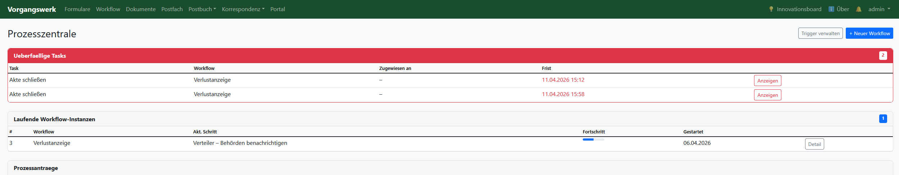
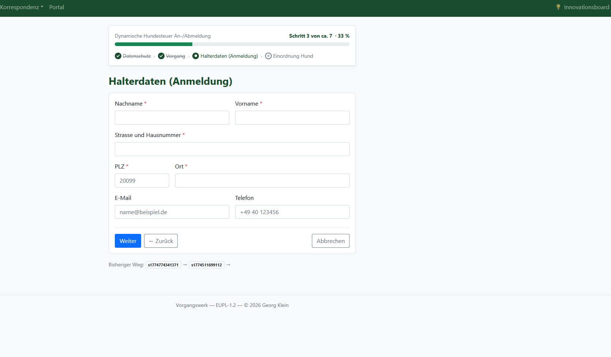

# Vorgangswerk

**Digitale Vorgangsbearbeitung für die öffentliche Verwaltung**

[](LICENSE)
[](https://github.com/geolohmar-star/vorgangswerk)
[](#barrierefreiheit)

Vorgangswerk ist eine quelloffene Plattform zur digitalen Bearbeitung von Verwaltungsvorgängen. Antragsformulare, Workflows, Dokumente und Kommunikation – in einer Anwendung, selbst gehostet, OZG-konform.

Lizenz: [EUPL-1.2](LICENSE) · Sprache: Deutsch · Stack: Django · PostgreSQL · Docker

---

## Warum Vorgangswerk?

Viele Behörden – besonders Kommunen und kleine Träger – stehen vor demselben Problem: Anträge kommen per E-Mail oder Papier rein, werden in Excel verwaltet, und der Bearbeitungsstatus ist für niemanden transparent. Kommerzielle Lösungen sind teuer, proprietär und oft überdimensioniert.

Vorgangswerk schließt diese Lücke:

- **Kein Vendor Lock-in** – Open Source unter EUPL-1.2, selbst gehostet, volle Datenkontrolle
- **Kein IT-Großprojekt** – läuft mit `make pull` in unter einer Minute, ein einziger Docker-Befehl
- **Für die Praxis gebaut** – Formulare, Workflows, Dokumente und Postfach in einer Anwendung statt vier verschiedenen Systemen
- **OZG-konform** – BundID-Anbindung (SAML SP), öffentliche Antragsstrecken ohne Login, LeiKa-Schlüssel
- **Barrierefrei** – BITV 2.0 / WCAG 2.1 AA, gesetzliche Pflichtanforderung für Behördensoftware
- **Souverän** – kein SaaS, keine Cloud-Abhängigkeit, läuft on-premise oder im eigenen Rechenzentrum

**Für wen:**
Kommunalverwaltungen, Zweckverbände, kommunale Unternehmen, Behörden auf Landes- und Bundesebene sowie gemeinnützige Organisationen mit Verwaltungsaufgaben.

---

## Screenshots

**Visueller Pfad-Editor** – Verzweigte Antragsformulare per Drag & Drop



**Prozesszentrale** – Überfällige Tasks, laufende Workflows, Sachbearbeiter-Übersicht



**Bürgerseitige Antragsstrecke** – Mit Fortschrittsbalken, Breadcrumb-Navigation und mobilem Layout



---

## Funktionsübersicht

### Formulare & Antragsstrecken
- Visueller **Pfad-Editor** zum Aufbau mehrstufiger Antragsformulare (Drag & Drop, Verzweigungen, Transitionen)
- Über 20 Feldtypen: Text, Auswahl, Datum, Datei-Upload, Unterschrift, Tabelle, Adresse, IBAN u. v. m.
- **Bedingte Felder** (`zeige_wenn`) – Felder ein-/ausblenden abhängig von anderen Eingaben
- **Öffentliche Antragsstrecken** – ohne Login, mit Tracking-Link für Antragsteller
- **Quiz & Prüfbögen** – Multiple-Choice-Tests mit automatischer Auswertung und Zertifikat (geeignet für Einweisungen, Schulungen, Einbürgerungstest)
- PDF-Ausgabe ausgefüllter Anträge (WeasyPrint)
- Webhook-Benachrichtigungen bei Abschluss (JSON-POST an externe Systeme)

### Workflow-Engine
- Modellierung von Geschäftsprozessen als visuelle Workflows (Knoten, Transitionen, Bedingungen)
- Aufgabenverwaltung mit Zuweisung an Benutzer und Teams
- Arbeitsstapel-Übersicht für Sachbearbeiter
- Prozesszentrale mit Gesamtüberblick aller laufenden Instanzen

### Dokumentenmanagementsystem (DMS)
- Verwaltung von Dokumenten mit Versionierung und Zugriffsschutz
- Integration von **OnlyOffice** (WOPI) zur direkten Bearbeitung im Browser
- Klassifizierung als öffentlich, intern oder sensibel
- Zeitlich begrenzte Zugriffsschlüssel für sensible Dokumente (AES-256-GCM)
- Automatisches Backup (täglich/wöchentlich/monatlich)

### Kommunikation
- IMAP-basierter **E-Mail-Worker** für eingehende Nachrichten
- Postfach-Ansicht mit Zuordnung zu Vorgängen
- E-Mail-Benachrichtigungen bei Workflow-Ereignissen

### Digitale Signatur
- **FES** (Fortgeschrittene Elektronische Signatur) intern via pyHanko
- **QES** (Qualifizierte Elektronische Signatur) via sign.me (Bundesdruckerei)
- Signaturstatus, Validierung und Zertifikatsverwaltung

### Portal (KI-gestützter Formular-Import)
- Prepaid-Portal für externe Nutzer
- PDF-Formular hochladen → Claude KI analysiert Struktur → fertiger Pfad wird automatisch angelegt
- Stripe-Integration für Credit-Kauf
- BentoPDF / Stirling-PDF Integration als PDF-Werkzeug

### BundID-Anbindung ✓ BundID-ready
- **SAML SP-Integration implementiert** – Anbindung an `test.id.bund.de` / `id.bund.de` ohne Codeänderungen möglich
- HTTP-POST-Binding, ACS-Callback, SP-Metadaten-Endpoint
- Benutzeranlage und -aktualisierung anhand des bPK2 (Bereichsspezifisches Personenkennzeichen)
- Getestet mit offiziellem BundID-Simulator (`ghcr.io/ba-itsys/bundid-simulator`)
- Für Produktivbetrieb: SP-Registrierung beim ITZBund + SP-Zertifikat (kein Codeaufwand)
- OZG-Anforderung erfüllt: Kommunen benötigen kein eigenes Identity-Management

### Core & Administration
- Benutzerverwaltung mit MFA (TOTP), Brute-Force-Schutz (django-axes)
- REST-API via django-ninja
- Dashboard mit Live-Daten aus allen Apps
- Profilverwaltung mit Benachrichtigungseinstellungen

---

## Barrierefreiheit

Vorgangswerk ist auf Konformität mit **BITV 2.0 / WCAG 2.1 AA** ausgerichtet – Pflichtanforderung für Behördensoftware gemäß § 12a BGG.

Umgesetzte Maßnahmen:

- **Tastaturnavigation**: Skip-Link, semantische Landmarks (`<main>`, `<nav>`, `<footer>`), `tabindex`-Fokus-Management
- **Screenreader**: `aria-hidden` auf alle dekorativen Icons/Emojis, `aria-label` auf Kachel-Links und Schaltflächen
- **Formulare**: `<fieldset>`/`<legend>` für Radio- und Checkbox-Gruppen, korrekte `<label for=...>`-Verknüpfung, `aria-required` auf Pflichtfeldern, Pflichtfeld-Sterne mit `aria-hidden`
- **Fortschrittsanzeige**: `<nav aria-label="Formularfortschritt">` mit `aria-current="step"` auf dem aktiven Schritt
- **Fehlermeldungen**: `role="alert"` + `aria-live="assertive"`, Fokus springt automatisch auf Fehler-Box
- **Überschriftenhierarchie**: Abschnitts-Header als `<h2 class="h6">` (kein H1→H6-Sprung)
- **Signatur-Feld**: `role="img"` + `aria-labelledby` auf Canvas, Tastatur-Alternative (Bestätigungs-Checkbox)
- **Gruppen-Felder**: `role="list"` / `role="listitem"`, Fokus nach Hinzufügen auf erstes Feld des neuen Eintrags

---

## Technischer Stack

| Komponente | Technologie |
|---|---|
| Backend | Django 5.x, Python 3.12 |
| Datenbank | PostgreSQL 16 |
| PDF-Generierung | WeasyPrint |
| Dokumenteneditor | OnlyOffice (WOPI) |
| Statische Dateien | Whitenoise |
| Webserver | Gunicorn |
| Deployment | Docker / Docker Compose |
| KI-Analyse | Anthropic Claude API |
| Zahlung | Stripe |
| Signatur | pyHanko, sign.me |

---

## Demo

Eine öffentliche Demo-Instanz ist verfügbar unter:

**https://vorgangswerk.georg-klein.com**

| Feld | Wert |
|---|---|
| Benutzer | `demo@vorgangswerk.de` |
| Passwort | `Demo1234!` |
| Rolle | Sachbearbeiter (kein Admin, keine Benutzerverwaltung) |

---

## Schnellstart (Docker)

**Voraussetzungen:** Docker, Docker Compose, Make

### Option A – Fertiges Image (empfohlen, ~30 Sekunden)

```bash
# 1. Repository klonen
git clone https://github.com/geolohmar-star/vorgangswerk.git
cd vorgangswerk

# 2. .env anlegen und anpassen
make setup
# SECRET_KEY generieren:
python -c "import secrets; print(secrets.token_urlsafe(50))"
# Wert in .env bei SECRET_KEY eintragen, DB_PASSWORD setzen

# 3. Fertiges Image laden und starten
make pull

# 4. Superuser anlegen
make superuser
```

### Option B – Selbst bauen (~5-10 Minuten)

```bash
make setup   # .env anlegen
make build   # Image bauen und starten
make superuser
```

Die Anwendung ist danach unter **http://localhost:8100** erreichbar.

### Weitere Befehle

```bash
make start      # Starten
make stop       # Stoppen
make restart    # Web-Container neu starten
make logs       # Logs live verfolgen
make shell      # Django-Shell
make demo       # Demo-Daten laden (Beispiel-Pfad, Workflow, Testbenutzer)
make update     # git pull + neu bauen + migrieren
```

### Optionale Dienste

```bash
# Mit eigenem OnlyOffice-Container
docker compose --profile onlyoffice up -d
```

---

## Umgebungsvariablen

| Variable | Pflicht | Beschreibung |
|---|---|---|
| `SECRET_KEY` | Ja | Django Secret Key |
| `DB_PASSWORD` | Ja | PostgreSQL-Passwort |
| `ALLOWED_HOSTS` | Ja | Kommagetrennte Hostnamen |
| `ANTHROPIC_API_KEY` | Nein | Für KI-Formularanalyse (Portal) |
| `ONLYOFFICE_URL` | Nein | URL des OnlyOffice-Servers |
| `ONLYOFFICE_JWT_SECRET` | Nein | JWT-Secret für OnlyOffice |
| `SIGNME_API_KEY` | Nein | Für QES via sign.me |
| `EMAIL_HOST` | Nein | SMTP für ausgehende E-Mails |
| `IMAP_HOST` | Nein | IMAP für eingehende E-Mails |
| `STRIPE_PUBLIC_KEY` | Nein | Stripe (Portal-Zahlungen) |
| `STRIPE_SECRET_KEY` | Nein | Stripe Secret |
| `VERSCHLUESSEL_KEY` | Nein | AES-Key für sensible Dokumente |
| `BENTOPDF_URL` | Nein | URL zu BentoPDF/Stirling-PDF |

Eine vollständige Vorlage: `.env.example`

---

## Projektstruktur

```
vorgangswerk/
├── core/           – Benutzerverwaltung, Dashboard, API
├── formulare/      – Pfad-Editor, Antragsstrecken, Quizmodul
├── workflow/       – Workflow-Engine, Arbeitsstapel
├── dokumente/      – DMS, OnlyOffice-Integration
├── kommunikation/  – E-Mail-Worker, Postfach
├── korrespondenz/  – Briefvorlagen, Schreiben
├── signatur/       – FES/QES-Integration
├── portal/         – KI-Portal, Stripe, PDF-Analyse
├── quiz/           – Fragenpools, BAMF-Einbürgerungstest
├── config/         – Django-Einstellungen, URLs
├── static/         – JavaScript, CSS
├── templates/      – Basis-Templates
└── docker-compose.yml
```

---

## Troubleshooting

| Problem | Lösung |
|---|---|
| Container startet nicht | `make logs` → fehlende `.env`-Werte prüfen (`SECRET_KEY`, `DB_PASSWORD`) |
| Datenbank nicht erreichbar | `docker compose ps db` → `docker compose restart db` |
| CSS/JS fehlt | `docker compose exec web python manage.py collectstatic --noinput` |
| Migrationen fehlgeschlagen | `docker compose exec web python manage.py migrate --verbosity 2` |
| E-Mail wird nicht versandt | `docker compose exec web python manage.py sendtestemail test@beispiel.de` |
| OnlyOffice öffnet nicht | `WOPI_BASE_URL` muss vom OnlyOffice-Container erreichbar sein |
| Gesperrter Benutzer (MFA) | `docker compose exec web python manage.py axes_reset` |
| Speicherplatz voll | `docker system prune -f` + alte Sicherungen prüfen |

Ausführliche Hilfe: [docs/BETRIEB.md](docs/BETRIEB.md#troubleshooting)

---

## Dokumentation

| Dokument | Inhalt |
|---|---|
| [Betriebsanleitung](docs/BETRIEB.md) | Updates, Backup/Restore, Logs, E-Mail, HTTPS, Troubleshooting |
| [Architektur](docs/ARCHITEKTUR.md) | App-Struktur, Datenmodelle, Datenfluss, Erweiterungspunkte |
| [Mitwirken](CONTRIBUTING.md) | Entwicklungsumgebung, PR-Workflow, Code-Stil |

---

## Mitmachen

Beiträge sind willkommen. Bitte:

1. Fork erstellen
2. Feature-Branch anlegen (`git checkout -b feature/mein-feature`)
3. Änderungen committen
4. Pull Request öffnen

Für größere Änderungen, Fragen oder Fehlerberichte bitte ein [GitHub Issue](https://github.com/geolohmar-star/vorgangswerk/issues) anlegen.

---

## Lizenz

Veröffentlicht unter der [European Union Public Licence 1.2 (EUPL-1.2)](LICENSE).

Die EUPL-1.2 ist die offizielle Open-Source-Lizenz der Europäischen Kommission – entwickelt speziell für den Einsatz in der öffentlichen Verwaltung. Sie ist in allen 23 EU-Amtssprachen rechtsverbindlich verfasst und damit eine der wenigen Lizenzen, die in einem deutschen Behördenumfeld ohne rechtliche Graubereiche eingesetzt werden kann.

Für den Verwaltungseinsatz relevant:

- **Nutzung ist kostenfrei und dauerhaft gesichert** – keine Abhängigkeit von Lizenzgebühren oder Herstellerentscheidungen
- **Quellcode-Einsicht ist garantiert** – Behörden können den Code prüfen, anpassen und weitergeben
- **Copyleft-Pflicht** – Weiterentwicklungen müssen ebenfalls unter EUPL veröffentlicht werden; verhindert proprietäre Abspaltungen
- **Kompatibel mit opencode.de** – der deutschen Open-Source-Plattform für die Verwaltung; EUPL-1.2 ist dort die bevorzugte Lizenz
- **Kompatibel mit GPL, LGPL, MPL u. a.** – problemlose Kombination mit anderen Open-Source-Komponenten

---

## Kontakt

Georg Klein · [vorgangswerk@georg-klein.com](mailto:vorgangswerk@georg-klein.com)

Für Bugs und Feature-Anfragen bitte [GitHub Issues](https://github.com/geolohmar-star/vorgangswerk/issues) verwenden.
